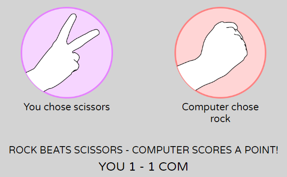

# Rock Paper Scissors Lizard Spock

Rock Paper Scissors Lizard Spock is a variation on the classic Rock Paper Scissors game. This site is fully responsive and makes use of JavaScript to allow the user to play Rock Paper Scissors Lizard Spock against the computer in a best of five series (first to three wins). It is intended to demonstrate the capabilities of JavaScript in a fun and relaxed environment.

## Design

### Wireframe

### Typography

The fonts selected for the heading and body are "Bubblegum Sans" and "Varela Round" respectively. Both come from Google Fonts.

Bubblegum Sans is described in the Google Fonts About section as "upbeat, flavor-loaded, brushalicious letters for the sunny side of the street". This font was selected to give the user an immediate sense of fun and play.

Similarly, Varela Round was selected to provide the user with a relaxed, soft feel, as well as being easy to read.

### Colour Scheme

Each of the five options has a different colour - red for rock, yellow for paper, purple for scissors, green for lizard, and blue for Spock, all with a white hand gesture. To ensure a good contrast between all of these colours and black text, a neutral grey background was selected for the game panel.

## Features

This is a single page site with a simple game panel which allows the user to play a game of Rock Paper Scissors Lizard Spock against a computer opponent.

### Heading

- In addition to projecting a sense of fun, the heading is bold and is intended to draw the user's attention and establish the game they are about to play.

### Game Area

- This section is where the game will be played, and consists of player's selection, results area and scoring. The user is invited to pick one of the five options, and is informed that the first to score 3 points will win the game. A Rules button directs the user to the Rock Paper Scissors wikipedia page, which also details variations such as Rock Paper Scissors Lizard Spock.

### Player's Selection

- The user makes a selection by clicking on one of the five options, which will in turn start the game between the user and the computer.

### Scenarios

- Prior to the game beginning, the user is shown a graphic which illustrates the win/loss outcomes of the game.

### Scoreboard

- At the bottom of the game area, a scoreboard will keep a points tally between the user and computer.

### Result

- Making a selection will start the game, and the scenarios graphic will be replaced with the user's and computer's selections respectively. Depending on the selections, the user will be informed of the outcome, and a point will be given to either the user or the computer. In the event of a draw, the points tally will not change. The user can then make another selection to continue the game.

### Final Score

- When either the user or computer's score reaches three, the final result and score is displayed. The user selection buttons are disabled, and a "Play Again" button appears to invite the user to play another game. When this is clicked, the Game Area will return to its initial state.

### Features to be implemented

## Testing

### Fixed Bugs

### Unfixed Bugs

### Validator Testing

#### HTML

#### CSS

#### JavaScript

#### Accessibility

## Deployment

The site was deployed using Github Pages as follows:
- In the GitHub repository, go to settings.
- Navigate to the Pages section.
- Select Deploy from a branch from the Source drop-down menu.
- Select main from the Branch drop-down menu.
- Select /(root) from the Folder drop-down menu, and save.

The live link for the site is: 
https://jp-clarke.github.io/rock-paper-scissors-lizard-spock/

## Credits

### Content

### Images

### Acknowledgements

